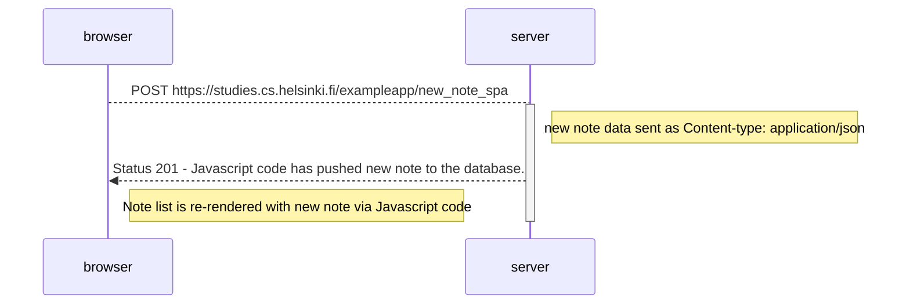

```mermaid
sequenceDiagram
browser-->server: POST https://studies.cs.helsinki.fi/exampleapp/new_note_spa
activate server
Note right of server: new note data sent as Content-type: application/json
server-->>browser: Status 201 - Javascript code has pushed new note to the database.
Note right of browser: Note list is re-rendered with new note via Javascript code
deactivate server
```
